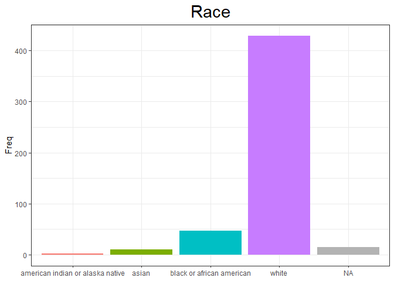
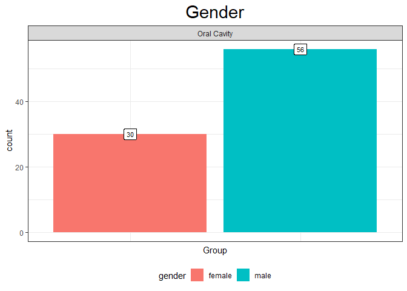
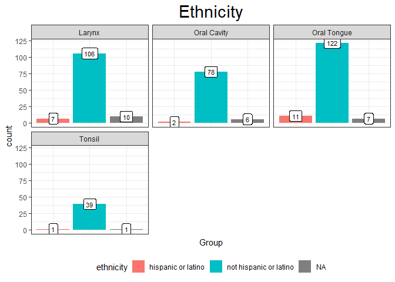
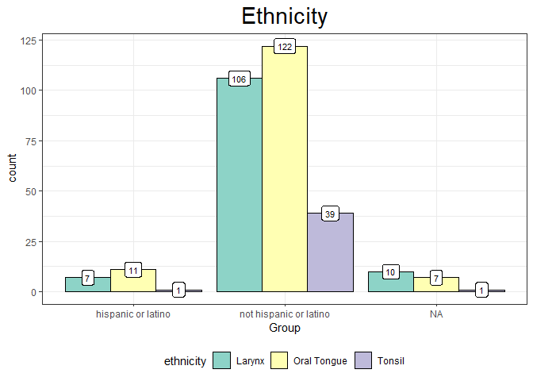
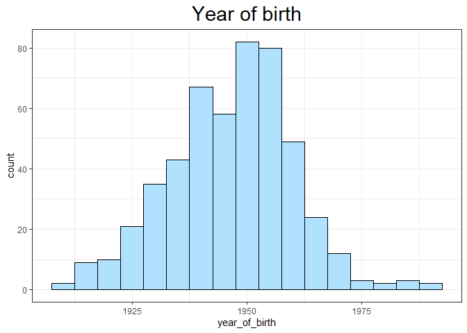
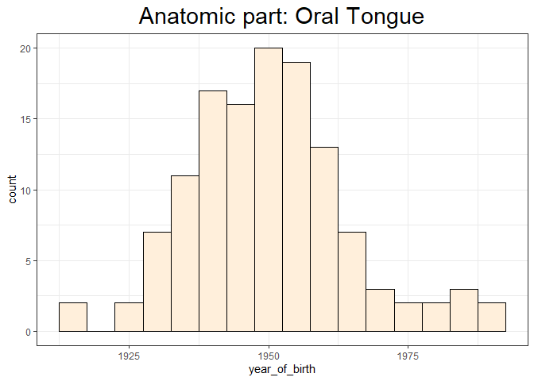

Demographics and Anatomy
================

# 1\. Download the data

``` r
rse_gene <- 
  create_rse(
    subset(
      available_projects(),
      project == "HNSC" & project_type == "data_sources"
    )
  )
```

# 2\. Create dataframe with metadata

``` r
sample_sheet <-
  colData(rse_gene) %>%
  data.frame() %>%
  rownames_to_column("sample_id")

sample_sheet %>% select(c(1:4)) %>% 
  head(n = 3)
```

    ##                              sample_id rail_id
    ## 1 580c059f-1b04-4229-8047-dcb3bc29fb01  106638
    ## 2 1fdbec79-d894-4b18-b515-9462c959f503  106654
    ## 3 7e2c9da9-bc94-48ae-a949-3ec3fa9bcf04  106662
    ##                            external_id study
    ## 1 580c059f-1b04-4229-8047-dcb3bc29fb01  HNSC
    ## 2 1fdbec79-d894-4b18-b515-9462c959f503  HNSC
    ## 3 7e2c9da9-bc94-48ae-a949-3ec3fa9bcf04  HNSC

    ## [1] "Number of columns in metadata: 938"

Check if two columns with sample types are matching

``` r
all(sample_sheet[, "tcga.cgc_sample_sample_type"] == sample_sheet[, "tcga.gdc_cases.samples.sample_type"])
```

    ## [1] TRUE

# 3\. Data frame for demographic info (+anatomic part and sample type)

``` r
demo <- sample_sheet %>% 
            select(contains("patient_barcode"), 
                   ends_with("xml_anatomic_neoplasm_subdivision"), 
                   contains(c(".sample_type", "demographic")), 
                   -contains("sample_type_id")) %>% 
  rename_with(~ gsub(".*\\.", "", .x)) %>% 
  rename(patient_barcode = xml_bcr_patient_barcode,
         anatomic_part = xml_anatomic_neoplasm_subdivision)

head(demo %>% select(c(1:3)), 4)
```

    ##   patient_barcode anatomic_part         sample_type
    ## 1    TCGA-CV-6942   Oral Cavity       Primary Tumor
    ## 2    TCGA-MZ-A5BI        Tonsil       Primary Tumor
    ## 3    TCGA-CV-6938   Oral Cavity Solid Tissue Normal
    ## 4    TCGA-CV-A45Y        Larynx       Primary Tumor

    ## All included columns:
    ## 
    ## 1. patient_barcode
    ## 2. anatomic_part
    ## 3. sample_type
    ## 4. updated_datetime
    ## 5. gender
    ## 6. submitter_id
    ## 7. year_of_birth
    ## 8. race
    ## 9. demographic_id
    ## 10. ethnicity
    ## 11. year_of_death

## Duplicated patients

    ## [1] "Number of duplicated barcodes: 45"

    ## [1] "Total number of patients: 548"

    ## [1] "Number of unique patients: 503"

# 4\. Plots

## Functions for plotting:

``` r
freq_table <- function(df, var, distinct = FALSE) {
  
  if (distinct == TRUE) {
    df <- df %>% distinct(patient_barcode, .keep_all = TRUE)
  }
  dt <- table(df[, var]) %>% as.data.frame() %>% 
    mutate(prop = Freq / sum(.$Freq) * 100) %>% 
    arrange(desc(prop))
  
  dt[which(dt == 'not reported'), 1] <- NA 
  dt[, 1] <- factor(dt[, 1], levels = dt[, 1][order(dt$Freq)])
  
  return(dt)
  
}
```

``` r
pie_chart <- function(freq, title, label = title) {
  
  ggplot(freq, aes(x = "", y = Freq, fill = Var1)) +
  geom_bar(stat="identity", width=1, color = "white") +
  coord_polar("y", start=0) +
  theme_void() +
  geom_text_repel(aes(label = paste0(round(prop, 2), "%")), 
                  position = position_stack(vjust=0.5), color = "black", size = 4) +
  ggtitle(title) +
  theme(plot.title = element_text(hjust = 0.5, size = 22)) +
  labs(fill = label)
}
```

``` r
plot_hist <- function(freq, title, label = title) {
  
  ggplot(freq, aes(x = Var1, y = Freq)) +
  geom_bar(aes(fill = Var1), stat = 'identity') +
  ggtitle(title) +
  theme_bw() +
  theme(plot.title = element_text(hjust = 0.5, size = 22),
        legend.position = 'none',
        axis.title.x = element_blank()) +
  labs(fill = label) +
  scale_fill_discrete(na.value = "grey70")
  
}
```

``` r
anatomy_plot <- function(df, parts, dem) {
  
  df[df == "not reported"] <- NA
  df <- df[, c("anatomic_part", dem), drop = F] %>% 
    filter(anatomic_part %in% parts) %>% 
    gather(key = "Demographics", value = "Group", -anatomic_part) %>% 
    group_by(anatomic_part, Demographics, Group) %>% 
    summarise(count = n(), .groups = "drop") %>% as.data.frame()

  ggplot(df %>% filter(Demographics == dem), aes(x = Group, y = count)) +
              geom_bar(aes(fill = Group), stat = "identity") +
              geom_label(aes(x = Group, y = count, label = count),
                              size = 3) +
              facet_wrap(. ~ anatomic_part, ncol = 3) +
      ggtitle(str_to_title(dem)) +
      labs(fill = dem) +
      theme_bw() +
      theme(axis.text.x=element_blank(),
            axis.ticks.x=element_blank(),
            legend.position = "bottom",
            plot.title = element_text(hjust = 0.5, size = 22))
}
```

``` r
anatomy_plot_2 <- function(df, parts, dem) {
  
  df[df == "not reported"] <- NA
  df <- df[, c("anatomic_part", dem), drop = F] %>% 
    filter(anatomic_part %in% parts) %>% 
    gather(key = "Demographics", value = "Group", -anatomic_part) %>% 
    group_by(anatomic_part, Demographics, Group) %>% 
    summarise(count = n(), .groups = "drop") %>% as.data.frame() %>% ungroup()
  
  ggplot(df %>% filter(Demographics == dem), aes(x = Group, y = count)) +
              geom_bar(aes(fill = anatomic_part), color = "black", 
                       stat = "identity", position = "dodge") +
              geom_label(aes(label = count),
                              size = 3, position = position_dodge2(width = 0.9) ) +
      ggtitle(str_to_title(dem)) +
      labs(fill = dem) +
      theme_bw() +
      theme(legend.position = "bottom",
            plot.title = element_text(hjust = 0.5, size = 22)) +
      scale_fill_brewer(palette = "Set3")
}
```

## 1\) Gender / Race / Ethnicity

``` r
gender <- pie_chart(freq_table(demo, c("gender"), T), "Gender")
race <- pie_chart(freq_table(demo, c("race"), T), "Race")
ethn <- pie_chart(freq_table(demo, c("ethnicity"), T), "Ethnicity")

gender
```

<!-- -->

``` r
race + scale_fill_brewer(palette = "Set2", na.value = "grey70")
```

<!-- -->

``` r
ethn + scale_fill_brewer(palette = "Dark2", na.value = "grey70")
```

<!-- -->

``` r
gender_h <- plot_hist(freq_table(demo, "gender", T), "Gender", "Gender")
race_h <- plot_hist(freq_table(demo, "race", T), "Race", "Race")
ethn_h <- plot_hist(freq_table(demo, "ethnicity", T), "Ethnicity", "Ethnicity")

gender_h
```

<!-- -->

``` r
race_h
```

<!-- -->

``` r
ethn_h
```

<!-- -->

## 2\) Anatomic features

``` r
anat <- pie_chart(freq_table(demo, "anatomic_part"), "Anatomy")
anat_h <- plot_hist(freq_table(demo, "anatomic_part"), "Anatomy", "Part of the body")
```

``` r
anat
```

<!-- -->

``` r
anat_h + theme(axis.text.x = element_text(angle = 15))+
  geom_label(data = (demo %>% 
                      group_by(anatomic_part) %>% 
                      summarise(count = n())),
            aes(x = anatomic_part, y = count, label = count),
            size = 3)
```

<!-- -->

## 3\) Anatomic part + Gender/Race/Ethnicity

#### Examples: 1st version

``` r
anatomy_plot(demo, c("Oral Cavity"), c("gender"))
```

<!-- -->

``` r
anatomy_plot(demo, c("Oral Tongue", "Larynx", "Tonsil"), c("race"))
```

<!-- -->

``` r
anatomy_plot(demo, c("Oral Tongue", "Larynx", "Tonsil", "Oral Cavity"), c("ethnicity"))
```

<!-- -->

#### Examples: 2nd version

``` r
anatomy_plot_2(demo, c("Oral Tongue", "Larynx", "Tonsil"), c("ethnicity"))
```

<!-- -->

``` r
anatomy_plot_2(demo, c("Oral Tongue", "Larynx", "Tonsil", "Hypopharynx"), c("gender"))
```

<!-- -->

## 4\) Age (Year of birth)

``` r
summary(demo$year_of_birth)
```

    ##    Min. 1st Qu.  Median    Mean 3rd Qu.    Max.    NA's 
    ##    1909    1937    1947    1946    1955    1991       1

``` r
ggplot(demo %>% distinct(patient_barcode, .keep_all = TRUE), aes(x = year_of_birth)) +
  geom_histogram(binwidth = 5, color = "black", fill = "lightskyblue1") +
  theme_bw() +
  ggtitle("Year of birth") +
  theme(plot.title = element_text(hjust = 0.5, size = 22))
```

    ## Warning: Removed 1 rows containing non-finite values (stat_bin).

<!-- -->

#### Examples: 1 anatomical feature

``` r
ggplot(demo %>% distinct(patient_barcode, .keep_all = TRUE) %>% 
           filter(anatomic_part == "Oral Tongue"), aes(x = year_of_birth)) +
  geom_histogram(binwidth = 5, color = "black", fill = "antiquewhite1") +
  theme_bw() +
  ggtitle(paste0("Anatomic part: ", "Oral Tongue")) +
  theme(plot.title = element_text(hjust = 0.5, size = 22))
```

    ## Warning: Removed 1 rows containing non-finite values (stat_bin).

<!-- -->

``` r
ggplot(demo %>% distinct(patient_barcode, .keep_all = TRUE) %>% 
           filter(anatomic_part == "Tonsil"), aes(x = year_of_birth)) +
  geom_histogram(binwidth = 5, color = "black", fill = "antiquewhite1") +
  theme_bw() +
  ggtitle(paste0("Anatomic part: ", "Tonsil")) +
  theme(plot.title = element_text(hjust = 0.5, size = 22))
```

<!-- -->

#### Examples: several anatomival features

``` r
ggplot(demo %>% distinct(patient_barcode, .keep_all = TRUE) %>% 
           filter(anatomic_part %in% c("Oral Tongue", "Larynx", "Tonsil")), 
         aes(x = year_of_birth, y = anatomic_part, fill = anatomic_part)) +
  geom_density_ridges(scale = 2, alpha=0.5) + theme_ridges() +
  scale_fill_brewer(palette = "Set3") +
  scale_y_discrete(expand = c(0.8, 0)) +
  scale_x_continuous(expand = c(0.01, 0)) +
  theme(legend.position = "bottom",
        axis.title.x=element_blank(),
        axis.title.y=element_blank(),
        legend.title = element_blank())
```

    ## Picking joint bandwidth of 3.55

    ## Warning: Removed 1 rows containing non-finite values (stat_density_ridges).

<!-- -->
