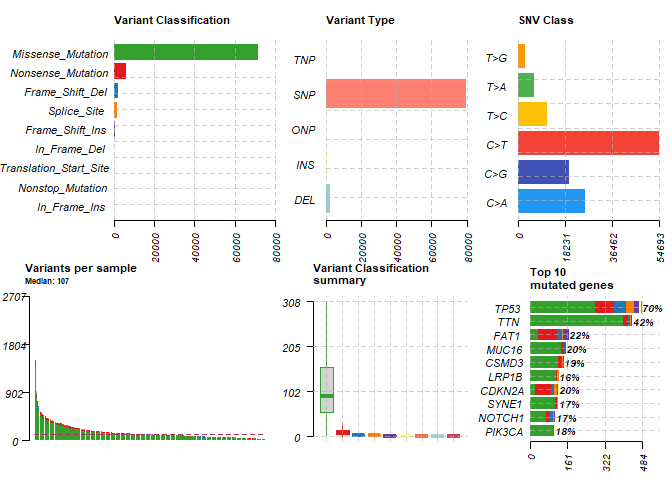
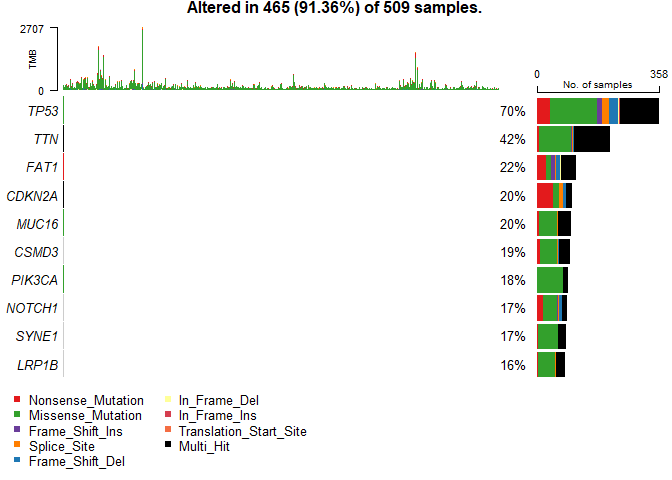
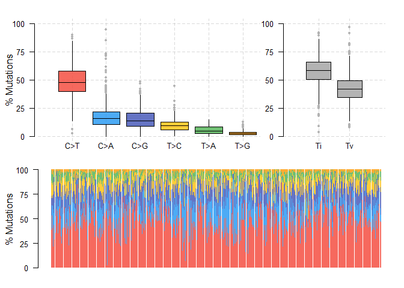
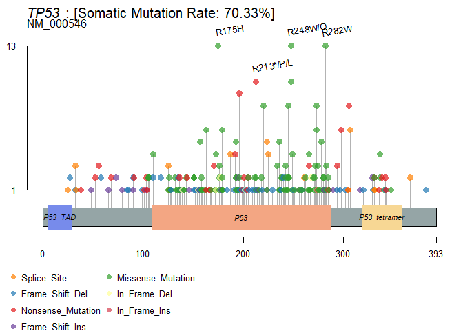
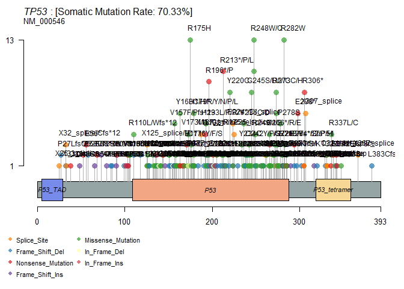
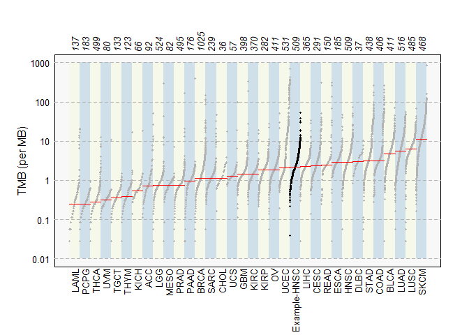
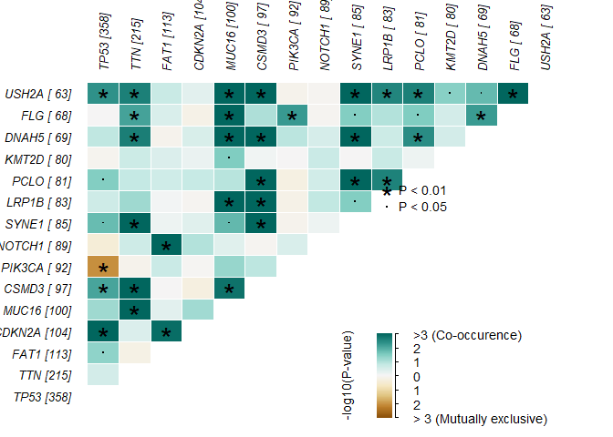
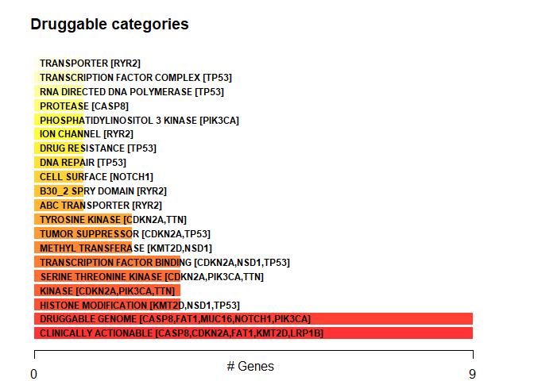
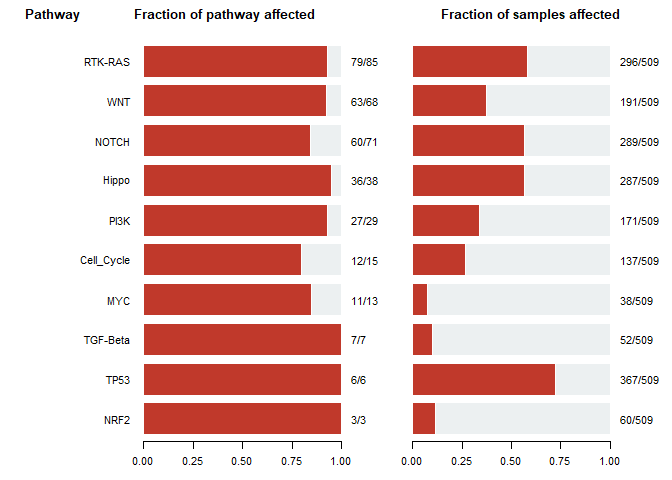
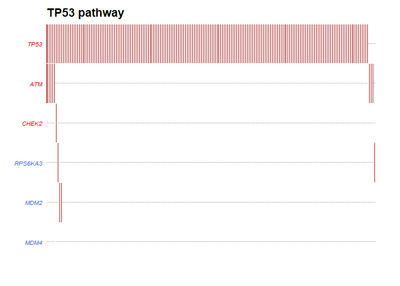

NGSPRINT\_Hackathon
================
Li Chuin Chong
9/13/2021

# Load all packages

``` r
# to look at the data
library(tidyverse)
```

    ## -- Attaching packages --------------------------------------- tidyverse 1.3.1 --

    ## v ggplot2 3.3.5     v purrr   0.3.4
    ## v tibble  3.1.4     v dplyr   1.0.7
    ## v tidyr   1.1.3     v stringr 1.4.0
    ## v readr   2.0.1     v forcats 0.5.1

    ## -- Conflicts ------------------------------------------ tidyverse_conflicts() --
    ## x dplyr::collapse()   masks IRanges::collapse()
    ## x dplyr::combine()    masks Biobase::combine(), BiocGenerics::combine()
    ## x dplyr::count()      masks matrixStats::count()
    ## x dplyr::desc()       masks IRanges::desc()
    ## x tidyr::expand()     masks S4Vectors::expand()
    ## x dplyr::filter()     masks stats::filter()
    ## x dplyr::first()      masks S4Vectors::first()
    ## x dplyr::lag()        masks stats::lag()
    ## x ggplot2::Position() masks BiocGenerics::Position(), base::Position()
    ## x purrr::reduce()     masks GenomicRanges::reduce(), IRanges::reduce()
    ## x dplyr::rename()     masks S4Vectors::rename()
    ## x dplyr::slice()      masks IRanges::slice()

``` r
# to visualize the mutation data
library(maftools)
# to create heatmaps
library(ComplexHeatmap)
```

    ## Loading required package: grid

    ## ========================================
    ## ComplexHeatmap version 2.9.4
    ## Bioconductor page: http://bioconductor.org/packages/ComplexHeatmap/
    ## Github page: https://github.com/jokergoo/ComplexHeatmap
    ## Documentation: http://jokergoo.github.io/ComplexHeatmap-reference
    ## 
    ## If you use it in published research, please cite:
    ## Gu, Z. Complex heatmaps reveal patterns and correlations in multidimensional 
    ##   genomic data. Bioinformatics 2016.
    ## 
    ## The new InteractiveComplexHeatmap package can directly export static 
    ## complex heatmaps into an interactive Shiny app with zero effort. Have a try!
    ## 
    ## This message can be suppressed by:
    ##   suppressPackageStartupMessages(library(ComplexHeatmap))
    ## ========================================

``` r
scale2 <- function(mat, ...) {
  t(scale(t(mat), ...))
}
```

# Somatic mutations

``` r
tryCatch(maf <- tcgaLoad(study = "HNSC"), 
         error = function(e) {
           print(paste(rep("#", 50), collapse = ""))
           print(paste0("# ERROR! Read the message below!", 
                        paste(rep(" ", 17), collapse = ""),
                        "#"))
           print(paste(rep("#", 50), collapse = ""))
           print(e)
           print(paste("If you're seeing this message you probably don't have",
                       "maftools package loaded, or have an older version.", 
                       "This function is available with v2.8.",
                       "Install the new version of maftools package with",
                       "`BiocManager::install('PoisonAlien/maftools')`", 
                       "and try again!"))
           })
```

    ## Loading HNSC. Please cite: https://doi.org/10.1016/j.cels.2018.03.002 for reference

## Plot MAF summary

``` r
plotmafSummary(maf = maf, rmOutlier = TRUE, 
               addStat = 'median', dashboard = TRUE, log_scale = FALSE)
```

<!-- -->

## Draw oncoplot for top ten mutated genes

``` r
oncoplot(maf = maf, top = 10)
```

<!-- -->

## Transition and tranversion

``` r
maf.titv = titv(maf = maf, plot = FALSE, useSyn = TRUE)

#plot titv summary
plotTiTv(res = maf.titv)
```

<!-- -->

## Lollipop plots for amino acid changes

``` r
top_label <-
  maf@data %>%
  filter(Hugo_Symbol == "TP53") %>%
  group_by(HGVSp_Short) %>%
  summarise(count = n()) %>%
  top_n(5) %>%
  pull(HGVSp_Short) %>%
  str_extract("[0-9]+")
```

    ## Selecting by count

``` r
lollipopPlot(maf, gene = 'TP53',labelPos = top_label, labPosAngle = 10, labPosSize = 1.0, legendTxtSize = 1.0, titleSize = c(1.5, 1.2))
```

    ## Assuming protein change information are stored under column HGVSp_Short. Use argument AACol to override if necessary.

    ## 8 transcripts available. Use arguments refSeqID or proteinID to manually specify tx name.

    ##    HGNC    refseq.ID   protein.ID aa.length
    ## 1: TP53    NM_000546    NP_000537       393
    ## 2: TP53 NM_001126112 NP_001119584       393
    ## 3: TP53 NM_001126118 NP_001119590       354
    ## 4: TP53 NM_001126115 NP_001119587       261
    ## 5: TP53 NM_001126113 NP_001119585       346
    ## 6: TP53 NM_001126117 NP_001119589       214
    ## 7: TP53 NM_001126114 NP_001119586       341
    ## 8: TP53 NM_001126116 NP_001119588       209

    ## Using longer transcript NM_000546 for now.

    ## Warning in lollipopPlot(maf, gene = "TP53", labelPos = top_label, labPosAngle =
    ## 10, : NAs introduced by coercion

    ## Removed 1 mutations for which AA position was not available

<!-- -->

``` r
#lollipopPlot(maf, "PIK3CA", labelPos = 'all') #just play around with interested mutated gene
```

``` r
lollipopPlot(maf, "TP53", labelPos = 'all')
```

    ## Assuming protein change information are stored under column HGVSp_Short. Use argument AACol to override if necessary.

    ## 8 transcripts available. Use arguments refSeqID or proteinID to manually specify tx name.

    ##    HGNC    refseq.ID   protein.ID aa.length
    ## 1: TP53    NM_000546    NP_000537       393
    ## 2: TP53 NM_001126112 NP_001119584       393
    ## 3: TP53 NM_001126118 NP_001119590       354
    ## 4: TP53 NM_001126115 NP_001119587       261
    ## 5: TP53 NM_001126113 NP_001119585       346
    ## 6: TP53 NM_001126117 NP_001119589       214
    ## 7: TP53 NM_001126114 NP_001119586       341
    ## 8: TP53 NM_001126116 NP_001119588       209

    ## Using longer transcript NM_000546 for now.

    ## Warning in lollipopPlot(maf, "TP53", labelPos = "all"): NAs introduced by
    ## coercion

    ## Removed 1 mutations for which AA position was not available

<!-- --> \#\#
Mutation load against TCGA cohorts

``` r
maf.mutload = tcgaCompare(maf = maf, cohortName = 'Example-HNSC', logscale = TRUE, capture_size = 50)
```

    ## Warning in FUN(X[[i]], ...): Removed 0 samples with zero mutations.

    ## Capture size [TCGA]:  35.8

    ## Capture size [Input]: 50

    ## Performing pairwise t-test for differences in mutation burden (per MB)..

<!-- -->

## Plot Variant Allele Frequencies (VAF)

``` r
#plotVaf(maf = maf, vafCol = '??')
```

## Somatic Interactions

``` r
somaticInteractions(maf, top = 15, pvalue = c(0.01, 0.05))
```

<!-- -->

    ##       gene1  gene2       pValue oddsRatio  00 11  01 10              Event
    ##   1: CDKN2A   TP53 5.279694e-11 9.0808511 145 98 260  6       Co_Occurence
    ##   2:  MUC16    FLG 1.156732e-07 4.4991709 372 31  37 69       Co_Occurence
    ##   3:  DNAH5  CSMD3 8.499273e-06 3.6597811 371 28  69 41       Co_Occurence
    ##   4:   PCLO  CSMD3 8.751552e-06 3.3902574 362 31  66 50       Co_Occurence
    ##   5:  SYNE1  USH2A 1.339301e-05 3.8701192 385 24  39 61       Co_Occurence
    ##  ---                                                                      
    ## 101: PIK3CA CDKN2A 8.871172e-01 0.9363208 331 18  86 74 Mutually_Exclusive
    ## 102:    FLG   TP53 1.000000e+00 1.0141658 131 48 310 20       Co_Occurence
    ## 103:  CSMD3   FAT1 1.000000e+00 0.9611714 320 21  92 76 Mutually_Exclusive
    ## 104:  KMT2D PIK3CA 1.000000e+00 0.9546521 351 14  78 66 Mutually_Exclusive
    ## 105:  KMT2D  SYNE1 1.000000e+00 0.9621116 357 13  72 67 Mutually_Exclusive
    ##                pair event_ratio
    ##   1:   CDKN2A, TP53      98/266
    ##   2:     FLG, MUC16      31/106
    ##   3:   CSMD3, DNAH5      28/110
    ##   4:    CSMD3, PCLO      31/116
    ##   5:   SYNE1, USH2A      24/100
    ##  ---                           
    ## 101: CDKN2A, PIK3CA      18/160
    ## 102:      FLG, TP53      48/330
    ## 103:    CSMD3, FAT1      21/168
    ## 104:  KMT2D, PIK3CA      14/144
    ## 105:   KMT2D, SYNE1      13/139

## Drug-Gene Interactions

``` r
dgi = drugInteractions(maf = maf, fontSize = 0.75)
```

<!-- -->

``` r
TP53.dgi = drugInteractions(genes = "TP53", drugs = TRUE)
```

    ## Number of claimed drugs for given genes:
    ##    Gene   N
    ## 1: TP53 193

``` r
TP53.dgi[,.(Gene, interaction_types, drug_name, drug_claim_name)]
```

    ##      Gene interaction_types     drug_name         drug_claim_name
    ##   1: TP53                                                   CTX-1
    ##   2: TP53                     GEMCITABINE             Gemcitabine
    ##   3: TP53                     GRANISETRON             GRANISETRON
    ##   4: TP53                      EPIRUBICIN              epirubicin
    ##   5: TP53                                 TOPICAL CORTICOSTEROIDS
    ##  ---                                                             
    ## 189: TP53                                                CEP-8983
    ## 190: TP53                     PANITUMUMAB             Panitumumab
    ## 191: TP53                   STREPTONIGRIN           STREPTONIGRIN
    ## 192: TP53                      SELICICLIB              Seliciclib
    ## 193: TP53                                               PD0166285

## Oncogenic Signaling Pathways

``` r
OncogenicPathways(maf=maf)
```

<!-- -->

    ##        Pathway  N n_affected_genes fraction_affected Mutated_samples
    ##  1:       NRF2  3                3         1.0000000              60
    ##  2:       TP53  6                6         1.0000000             367
    ##  3:   TGF-Beta  7                7         1.0000000              52
    ##  4:        MYC 13               11         0.8461538              38
    ##  5: Cell_Cycle 15               12         0.8000000             137
    ##  6:       PI3K 29               27         0.9310345             171
    ##  7:      Hippo 38               36         0.9473684             287
    ##  8:      NOTCH 71               60         0.8450704             289
    ##  9:        WNT 68               63         0.9264706             191
    ## 10:    RTK-RAS 85               79         0.9294118             296
    ##     Fraction_mutated_samples
    ##  1:               0.11787819
    ##  2:               0.72102161
    ##  3:               0.10216110
    ##  4:               0.07465619
    ##  5:               0.26915521
    ##  6:               0.33595285
    ##  7:               0.56385069
    ##  8:               0.56777996
    ##  9:               0.37524558
    ## 10:               0.58153242

``` r
PlotOncogenicPathways(maf = maf, pathways = "TP53")
```

<!-- -->

``` r
#Tumor suppressor genes are in red, and oncogenes are in blue font.
```
